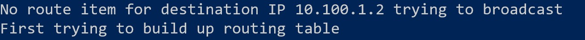
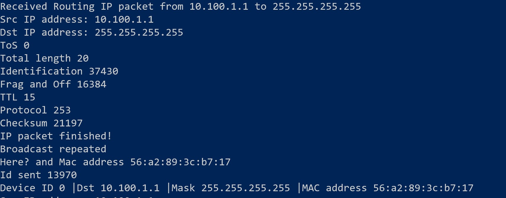
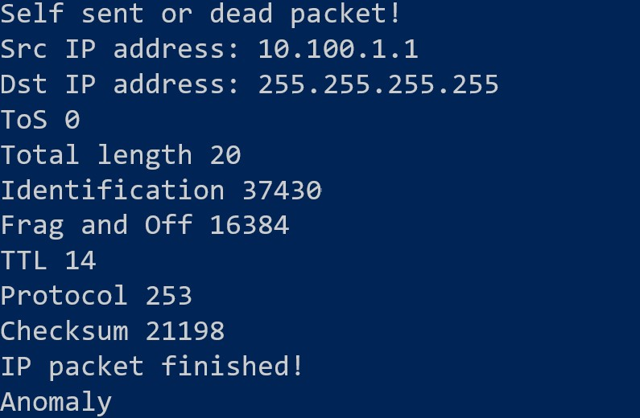
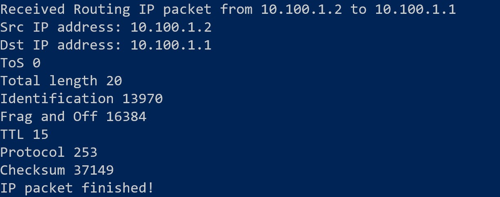
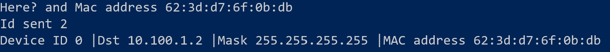

## Question 2
**`sendFrame()` requires the caller to provide the destination MAC address when sending IP packets, but users of IP layer won't provide the address to you. Explain how you addressed this problem when implementing IP protocol.** 

**Answer:** When the client tries to send an IP packet, first it searches the routing table for an entry corresponding to that IP address. If no entry has been found, then it issues an routing table update request to update the whole routing table. Then it broadcasts the IP packet. Since it takes time to receive routing responce, if again no entry is found in next `TIMEOUT` times, no update request will be sent.

## Question 3 
**Describe your routing algorithm.** 
**Answer:** I use a modified flooding algorithm. Each time the need routing table entry could not be found, an update request is sent. This is an broadcast using protocol number *253* which is reserved for experiments. If this routing packet is received by anyone, it will first check whether it has seen this packet. If seen, then it will simple discard the packet and do nothing for routing. Else it will update its routing table accoring to the `srcMAC` and `srcIP` of the routing packet. Then it sends a reply packet to the `scrIP` via `srcMAC` and also continues to broadcast this routing packet to all other devices attaching to it. If the routing packet received is sent by itself, it is also ignored.


First send broadcast update request.

Receive the request and update the routing table. Then repeat the request and send a reply.

Simply discard self sent packets.

Receive the reply and update the routing table.

Send the next packet using the right routing table entry.


## Question 4
**To implement routing properly, you need to detect other hosts/let other hosts know about you. In this lab, you are not required to detect hosts not running your protocol stack automatically/let them know about you, but you must not make them complain about strange incoming packets. Describe how your IP implementation achieved this goal.**
As showed in WT2. I wrapped the handle function of My Routing Protocol so the device receiving the routing packet would response correctly. For other devices, it is just a normal IP packet with IP protocol *253* which is reserved for experimental design.

## Question 5
**Describe how you correctly handled TCP state changes.**
I followed the RFC 793 almost exactly except the 2MSL timeout after TIME-WAIT state. I adopt two classes, a SocketStruct class and a SocketSession class to implement the TCP state changes. Each SocketStruct has three states, PASSIVE for listening sockets, ACTIVE for established sockets and UNSPECIFIED if the socket has just be opened by socket call. Each ACTIVE SocketStruct is attached to a SocketSession. Each PASSIVE socket is attached to a list of pending SocketSessions. Each time PASSIVE socket received a SYN, it emplaces a new SocketSession to the pending SocketSessions. The accept call continously check pending SocketSessions and allocate a new ACTIVE SocketStruct for each pending SocketSession. The state_ variable in each SocketSession maintains TCP state changes. According to RFC 793, open(), close() and arriving segments will change the TCP states and the behavior of send() and receive() call depend on the TCP states.

## Question 6
**Describe how you implemented in-order data transferring.**
Mainly I use Go-Back-N. Each time I send a packet, I "push" the packet to the messageQueue with a timeout of 2 seconds and record the time index information in a map. If the ack the packet is received within 2 seconds, the time index will be cleared from the map. The timeout will also be cleared according to the time index and packet will not actually be pushed into the messageQueue. If the ack is not received with 2 seconds, then the packet will actually be pushed into the messageQueue. Each SocketSession contains a thread responsible for retransmission. This thread continuously reads from the messageQueue. If the messageQueue is not empty, then the thread will read it out and retransmit the packet.


## Question 7
**Describe your evaluating methodology, result and usage of your evaluating method.**
I implement an echo client, an echo server and a router.
If you tap in any sequence and press enter, your message would be echoed back from the server.
```
sudo bash ./makeVNet < example.txt

#Disable kernel stack for all devices.

./tcptest_server 80 #start an echo server on port 80 on ns3
./ipRouter #start a router on ns2
./tcptest_client 10.100.2.2 80 #start an echo client on ns1. The 
client will connect to 10.100.2.2 port 80.
#Then you can type in any message you want to echo.
#Enable kernel stack for all devices. 
sudo bash ./removeVNet < example.txt
```
## Credit: Guo Zizheng
I use the messageQueue, a widget developed by Guo Zizheng to implement retransmission.